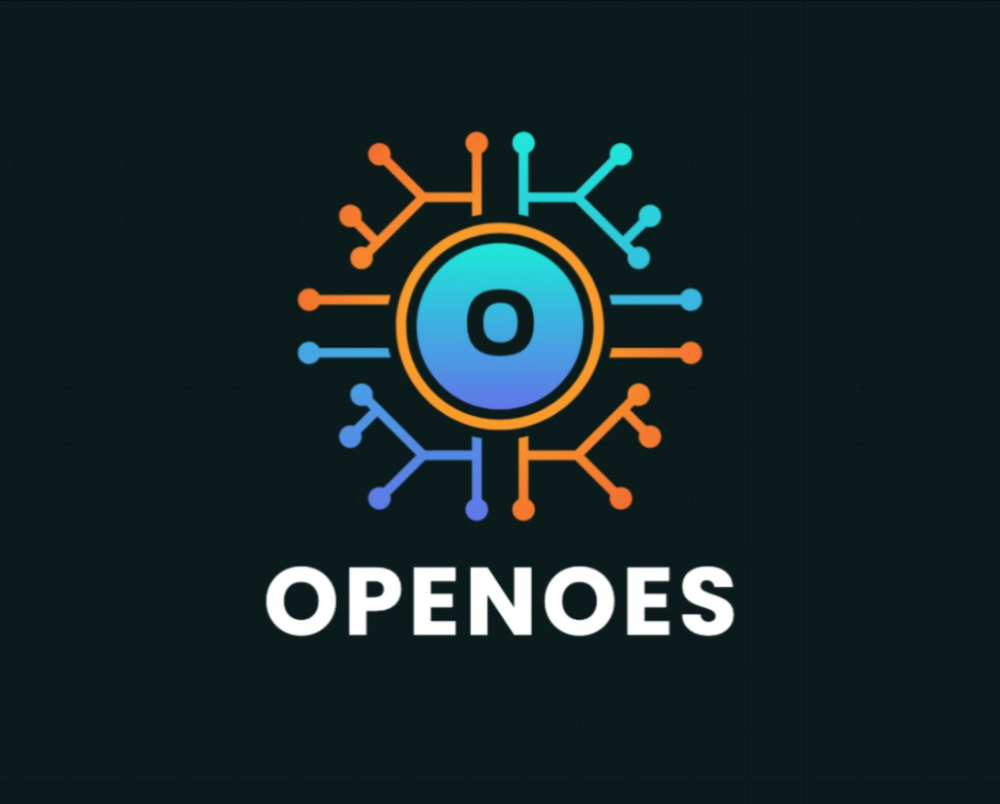
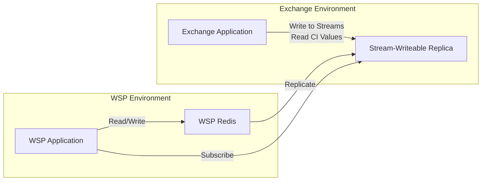

# OpenOES SDK



A comprehensive Python SDK for integrating with the OpenOES system, providing tools for both Wallet Service Providers (WSPs) and Exchanges. Created by [FXCH Ltd.](https://fxclr.com)

## Overview

The OpenOES SDK simplifies integration with the OpenOES system by providing a standardized approach for "off-Exchange" integration between cryptocurrency exchanges and custodians. It leverages Valkey distributed cache technology (with full Redis compatibility) to allow exchanges to "mirror" user asset balances held at Wallet Service Providers (WSPs) and custodians without requiring direct asset transfers.

This standard enables users to trade on exchanges using assets that remain securely held at their custodian of choice, addressing key challenges in the cryptocurrency trading ecosystem.

## Architecture

OpenOES operates on a unique architecture that enables secure, real-time communication between WSPs and Exchanges:



The OpenOES uses a specific Valkey/Redis architecture:

1. A main Valkey/Redis instance at the WSP
2. A replica Valkey/Redis instance with a special ACL configuration that allows the Exchange to:
   - Write specifically to stream keys
   - Read Credit Inventory (CI) values

This architecture ensures data integrity while enabling real-time communication between parties.

## Key Features

- **Standardized Integration**: One standard that works with multiple custodians and exchanges
- **Connection Management**: Simplified Valkey/Redis connection handling for both WSP and Exchange environments
- **Key Management**: Standardized Valkey/Redis key patterns for consistent data storage
- **ACL Management**: Secure access control for different components
- **Stream Processing**: Real-time event handling for pledges, settlements, and notifications
- **Credit Management**: Tools for managing credit requests, approvals, and inventory
- **Configuration Utilities**: Flexible configuration options for different environments
- **Testing Tools**: Comprehensive testing utilities for integration validation

## Installation

```bash
# Not yet available on PyPI
# pip install openoes

# For now, clone the repository and install locally
git clone <repository-url>
cd openoes
pip install -e .
```

### Prerequisites

- Python 3.7+
- Valkey 8.0+ or Redis 6.0+ (Valkey recommended for enhanced performance and features)
- redis-py client library (compatible with both Valkey and Redis)

## Comprehensive Usage Guide

### WSP Integration

The SDK provides a complete toolkit for WSP integration with the OpenOES system:

```python
from openoes_core import Configuration, RedisConnectionManager
from openoes_wsp import WSPClient

# Initialize configuration
config = Configuration.from_file('config.json')
# Or use a predefined profile
# config = ConfigurationProfile.development()

# Create connection manager
connection_manager = RedisConnectionManager(
    wsp_config=config.get_wsp_redis_config(),
    replica_config=config.get_replica_redis_config()
)

# Create WSP client
wsp_client = WSPClient(connection_manager, config)

# Request credit increase
response = wsp_client.request_credit_increase(
    user_id="user123",
    asset="BTC",
    amount=10.0,
    custodian_id="ledger",
    chain="Bitcoin",
    address="bc1q..."
)

# Check response status
if response.status == "accepted":
    print(f"Credit increase accepted, new balance: {response.new_balance}")
else:
    print(f"Credit increase rejected: {response.reject_reason}")

# Process settlement report
settlement_reports = wsp_client.process_settlement_reports()
for report in settlement_reports:
    print(f"Settlement report for {report.user_id}: {report.asset} {report.amount}")

# Monitor credit events
wsp_client.start_credit_event_listener(callback=lambda event: print(f"Credit event: {event}"))

# Clean up when done
connection_manager.close()
```

### Exchange Integration

The SDK also provides tools for Exchange integration:

```python
from openoes_core import Configuration, RedisConnectionManager
from openoes_exchange import ExchangeClient

# Initialize configuration
config = Configuration.from_file('config.json')

# Create connection manager
connection_manager = RedisConnectionManager(
    wsp_config=config.get_wsp_redis_config(),
    replica_config=config.get_replica_redis_config()
)

# Create Exchange client
exchange_client = ExchangeClient(connection_manager, config)

# Process credit requests
def handle_credit_request(request):
    user_id = request.user_id
    asset = request.asset
    amount = request.amount
    
    # Implement your business logic here
    approved = True
    reject_reason = ""
    
    if approved:
        # Update user's credit inventory
        exchange_client.update_credit_inventory(user_id, asset, amount)
        return exchange_client.approve_credit_request(request)
    else:
        return exchange_client.reject_credit_request(request, reject_reason)

# Start processing credit requests
exchange_client.start_credit_request_processor(callback=handle_credit_request)

# Read Credit Inventory values
ci_value = exchange_client.get_credit_inventory("user123", "BTC")
print(f"Credit Inventory for user123 BTC: {ci_value}")

# Generate settlement reports
settlement_reports = exchange_client.generate_settlement_reports()
for report in settlement_reports:
    print(f"Generated settlement report: {report}")

# Clean up when done
exchange_client.stop_credit_request_processor()
connection_manager.close()
```

### Event-Driven Architecture

OpenOES uses Redis Streams for event-driven communication:

```python
from openoes_core import StreamProcessor, KeyManager

# Create a stream processor
stream_processor = StreamProcessor(redis_client, consumer_group="my-app", consumer_name="consumer-1")

# Define a message handler
def handle_message(message):
    print(f"Received message: {message}")
    # Process the message
    return True  # Return True to acknowledge the message

# Start processing messages
stream_processor.process_stream(
    stream_key=KeyManager.credit_request_stream(),
    handler=handle_message,
    batch_size=10,
    block_ms=2000
)
```

## Core Components

### Connection Management

The SDK provides utilities for managing Redis connections:

```python
from openoes_core import RedisConnectionManager

# Create connection manager
connection_manager = RedisConnectionManager(
    wsp_config={
        "host": "localhost",
        "port": 6379,
        "password": "",
        "db": 0
    },
    replica_config={
        "host": "replica.example.com",
        "port": 6379,
        "password": "password",
        "db": 0
    }
)

# Get clients
wsp_client = connection_manager.get_wsp_client()
replica_client = connection_manager.get_replica_client()

# Use with context manager
with RedisConnectionManager(wsp_config, replica_config) as manager:
    # Connections are automatically closed when exiting the context
    wsp_client = manager.get_wsp_client()
```

### Key Management

The SDK provides utilities for generating and parsing Redis keys:

```python
from openoes_core import KeyManager

# Generate keys
ci_key = KeyManager.credit_inventory("user123", "BTC")
stream_key = KeyManager.exchange_stream("pledge", "user123")

# Parse keys
key_info = KeyManager.parse_key("CI:user123:BTC")
```

### ACL Management

The SDK provides utilities for setting up and managing Redis ACLs:

```python
from openoes_core import ACLManager, RedisConnectionManager

# Create connection manager with admin privileges
connection_manager = RedisConnectionManager(wsp_config)
admin_client = connection_manager.get_wsp_client()

# Create ACL manager
acl_manager = ACLManager(admin_client)

# Set up ACLs
acl_manager.setup_exchange_user("exchange", "password")
acl_manager.setup_wsp_user("wsp", "password")

# Test ACLs
exchange_client = connection_manager.get_replica_client()
acl_manager.test_exchange_permissions(exchange_client, "exchange:stream:test")
```

### Configuration

The SDK provides utilities for managing configuration:

```python
from openoes_core import Configuration, ConfigurationProfile

# Create configuration from file
config = Configuration.from_file('config.json')

# Create configuration from environment variables
config = Configuration.from_env(prefix="OPENOES_")

# Use predefined profiles
dev_config = ConfigurationProfile.development()
prod_config = ConfigurationProfile.production()
test_config = ConfigurationProfile.testing()

# Get configuration values
wsp_host = config.get("wsp_redis.host")
log_level = config.get("logging.level")

# Set configuration values
config.set("wsp_redis.host", "new-host.example.com")
```

## WSP Components

The WSP module provides components for WSP integration:

### Credit Request Manager

```python
from openoes_wsp import CreditRequestManager

# Create credit request manager
credit_manager = CreditRequestManager(connection_manager, config)

# Request credit increase
response = credit_manager.request_credit_increase(
    user_id="user123",
    asset="BTC",
    amount=10.0,
    custodian_id="ledger",
    chain="Bitcoin",
    address="bc1q..."
)
```

### Settlement Client

```python
from openoes_wsp import SettlementClient

# Create settlement client
settlement_client = SettlementClient(connection_manager, config)

# Process settlement reports
reports = settlement_client.process_settlement_reports()
```

### Pledge Manager

```python
from openoes_wsp import PledgeManager

# Create pledge manager
pledge_manager = PledgeManager(connection_manager, config)

# Create a pledge
pledge = pledge_manager.create_pledge(
    user_id="user123",
    asset="BTC",
    amount=5.0,
    custodian_id="ledger",
    chain="Bitcoin",
    address="bc1q..."
)
```

### Vault Manager

```python
from openoes_wsp import VaultManager

# Create vault manager
vault_manager = VaultManager(connection_manager, config)

# Get vault balance
balance = vault_manager.get_balance("BTC")
```

## Exchange Components

The Exchange module provides components for Exchange integration:

### Credit Manager

```python
from openoes_exchange import CreditManager

# Create credit manager
credit_manager = CreditManager(connection_manager, config)

# Process credit requests
credit_manager.start_processor(callback=lambda request: print(f"Processing request: {request}"))

# Read Credit Inventory
ci_value = credit_manager.get_credit_inventory("user123", "BTC")
```

### Settlement Manager

```python
from openoes_exchange import SettlementManager

# Create settlement manager
settlement_manager = SettlementManager(connection_manager, config)

# Generate settlement reports
reports = settlement_manager.generate_settlement_reports()
```

### Credit Inventory Processor

```python
from openoes_exchange import CreditInventoryProcessor

# Create credit inventory processor
inventory_processor = CreditInventoryProcessor(connection_manager, config)

# Update credit inventory
inventory_processor.update_inventory("user123", "BTC", 10.0)

# Read credit inventory
ci_value = inventory_processor.get_inventory("user123", "BTC")
```

### Account Integration

```python
from openoes_exchange import AccountIntegration

# Create account integration
account_integration = AccountIntegration(connection_manager, config)

# Apply credit to user account
account_integration.apply_credit("user123", "BTC", 10.0)
```

## Testing Components

The Testing module provides components for testing:

### Mock Redis Client

```python
from openoes_testing import MockRedisClient

# Create mock Redis client
mock_client = MockRedisClient()

# Set up test data
mock_client.set("test:key", "value")
mock_client.xadd("test:stream", {"field": "value"})

# Use in tests
assert mock_client.get("test:key") == "value"
```

### Data Generators

```python
from openoes_testing import DataGenerators

# Generate test data
user_id = DataGenerators.generate_user_id()
credit_request = DataGenerators.generate_credit_request(user_id, "BTC", 10.0)
```

### Test Scenarios

```python
from openoes_testing import TestScenarios

# Run a test scenario
scenario = TestScenarios.credit_request_approval_scenario()
scenario.run()
```

### Response Validators

```python
from openoes_testing import ResponseValidators

# Validate a response
credit_response = {"status": "accepted", "ci": "10.0"}
assert ResponseValidators.validate_credit_response(credit_response)
```

## Valkey/Redis as the Backbone


Valkey (with full Redis compatibility) serves as the backbone of the OpenOES solution, providing the critical infrastructure for real-time communication between WSPs and Exchanges. Valkey is recommended as the primary backend due to its enhanced performance and active community development, while maintaining full compatibility with existing Redis deployments. The OpenOES leverages several key Valkey/Redis features:

### Valkey/Redis Streams

Valkey/Redis Streams are used for event-driven communication between WSPs and Exchanges. This provides:

- Real-time event processing
- Reliable message delivery
- Consumer groups for load balancing
- Message acknowledgment and recovery

### Valkey/Redis ACLs

Access Control Lists (ACLs) in Valkey 8.0+ and Redis 6.0+ provide fine-grained security controls:

- Restricted write access for Exchanges (limited to stream keys)
- Restricted read access for Exchanges (limited to CI keys)
- Pattern-based key restrictions
- Command-level permissions
- User-based authentication

### Valkey/Redis Replication

The OpenOES architecture uses Valkey/Redis replication with a special configuration:

- WSP Valkey/Redis instance as the master
- Stream-Writeable Replica at the Exchange
- Special ACL configuration to allow limited writes to the replica and reading of CI values

This unique configuration enables secure, real-time communication while maintaining data integrity.

## License and Contribution

### License

This project is licensed under the GNU Affero General Public License v3.0 (AGPL-3.0) - see the LICENSE file for details.

### Contribution

Contributions to the OpenOES SDK are welcome. Please follow these steps to contribute:

1. Fork the repository
2. Create a feature branch
3. Make your changes
4. Run tests
5. Submit a pull request

### Acknowledgments

OpenOES is built on Valkey (with Redis compatibility), an open-source, high-performance data store used as a database, cache, and message broker. We extend our gratitude to both the Valkey and Redis communities for creating and maintaining these powerful tools that serve as the backbone of our solution.

---


*OpenOES SDK is created and maintained by [FXCH Ltd.](https://fxclr.com)*
